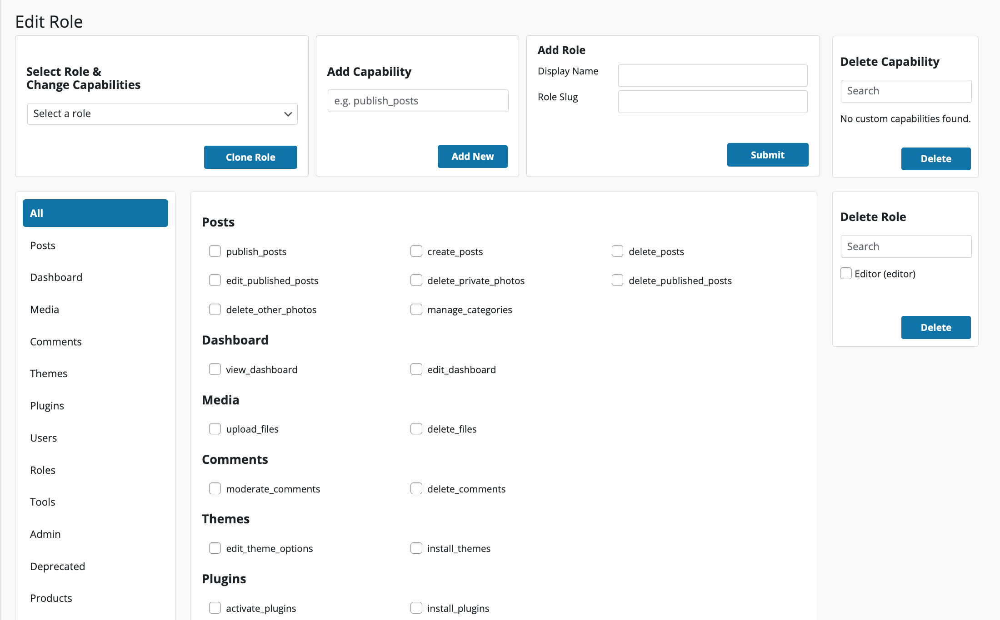
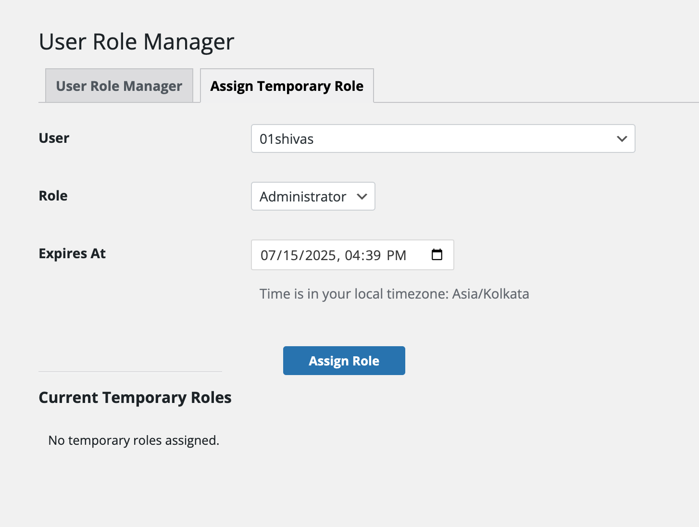
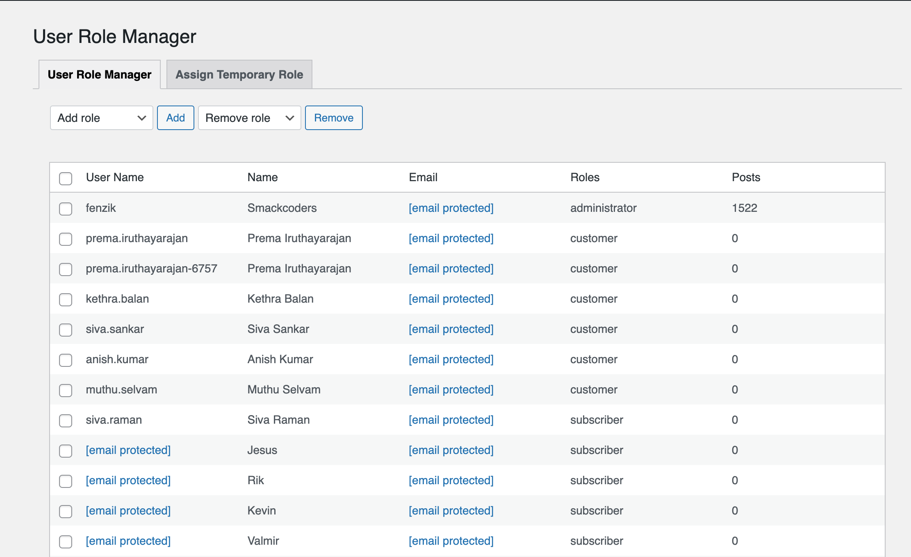
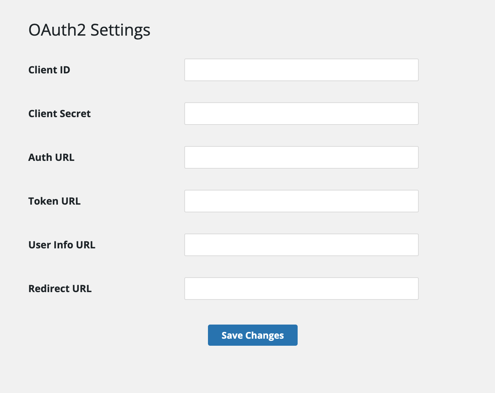

# Advanced User Role Manager

> Create and clone custom WordPress roles, grant time-limited access, add OAuth2 single sign-on, and log every change.

[](https://wordpress.org/)
[](https://php.net/)
[](https://www.gnu.org/licenses/gpl-2.0.html)

## Table of Contents

- [Overview](#overview)
- [Key Features](#key-features)
- [Use Cases](#use-cases)
- [Requirements](#requirements)
- [Installation](#installation)
- [Configuration & Setup](#configuration--setup)
- [Usage](#usage)
- [Supported Integrations](#supported-integrations)
- [Screenshots](#screenshots)
- [Documentation](#documentation)
- [FAQ](#faq)
- [Roadmap](#roadmap)
- [Changelog](#changelog)
- [Security](#security)
- [Contributing](#contributing)
- [Support](#support)
- [License](#license)
- [Disclaimer](#disclaimer)
- [Author](#author)

## Overview

Advanced User Role Manager is a custom user role manager for WordPress that extends the platform's built-in roles with the controls a real site actually needs day to day. You can build a role from scratch, clone an existing one as a starting point, and edit exactly which capabilities it carries — down to individual permissions like `edit_others_posts` or `manage_woocommerce`.

Two problems it solves directly: temporary access and accountability. Grant a contractor admin rights for a two-week project and the role expires on its own, with no reminder to set and no leftover access to clean up later. Every role and capability change — who made it, what changed, when — lands in a searchable audit log, so "who gave this account admin rights" stops being a question anyone has to guess at. A built-in OAuth2 login option adds single sign-on through Google, Microsoft (Azure AD), or any custom OAuth2 provider, right from the WordPress login page.

It's built for WordPress agencies managing contractor and freelancer access, membership and e-commerce sites that need tiered permissions, corporate and intranet sites enforcing role based access control, and any administrator who wants a record of role and capability changes instead of relying on memory.

## Key Features

- **Custom Role Creation & Cloning**: Create, edit, clone, and delete custom user roles from the admin dashboard — no code, no manual edits to role definitions.
- **Role Capability Editor**: Check or uncheck individual capabilities for any role, grouped by area (Posts, Pages, Users, Plugins, WooCommerce products, and more), plus support for adding your own custom capabilities.
- **Temporary Role Assignment & Expiration**: Assign a role with an expiration date and time. A wp-cron job checks every five minutes and revokes the role automatically once it expires, restoring the user's prior roles — ideal for contractor access or one-off admin tasks.
- **OAuth2 Single Sign-On**: A built-in login button on the WordPress login page supports Google and Microsoft (Azure AD) out of the box, or any custom OAuth2 provider by entering its authorization, token, and user-info endpoints. New accounts created through OAuth2 login are assigned the Subscriber role by default. The authorization flow is protected by a short-lived, single-use state token.
- **Role Filtering on the Users Screen**: Filter the WordPress Users screen by custom or native role directly from its built-in filter bar.
- **Role & Capability Import/Export**: Export selected roles — including their capabilities — as a JSON file, and import role definitions from JSON into another site. Existing roles are skipped automatically during import, so nothing gets overwritten.
- **Security Audit Logging**: A searchable, filterable audit log records every role and capability change with the user and timestamp, giving you a compliance-ready trail for security reviews. Log entries can be filtered by action, date range, or keyword, and exported or deleted in bulk.
- **Multi-Role Support**: Assign more than one role to a single user where your workflow requires overlapping permissions.
- **Clean Uninstall**: Uninstalling the plugin drops its database tables, deletes its options, and removes its stored user meta, so nothing is left behind.

## Use Cases

- **Contractor and freelancer access management**: Give a contractor temporary admin access or a freelancer a guest editor role for the length of a project, then let it expire automatically instead of remembering to revoke it.
- **Membership sites**: Support different access levels for different tiers of members using custom roles built around exactly the capabilities each tier needs.
- **Multi-author blogs and content teams**: Manage varying editorial permissions across contributors, editors, and guest writers.
- **E-commerce sites**: Separate customer-facing accounts from staff roles, with capability-level awareness of WooCommerce order, coupon, and product management.
- **Corporate and intranet sites**: Apply role based access control across departments and staff levels.
- **Educational platforms**: Distinguish student and teacher roles and the capabilities each should have.
- **Client site management**: Track role and capability changes across multiple client logins from a single, searchable audit log, and move a known-good role setup between sites with import/export.

## Requirements

| Requirement | Version |
| --- | --- |
| WordPress | 6.8 or higher (tested up to 7.0) |
| PHP | 7.0 or higher |
| MySQL | 5.6 or higher |

An OAuth2 client ID and secret are needed only if you enable single sign-on login — the plugin works fully without it.

## Installation

### Install from WordPress

1. Go to **Plugins → Add New** in your WordPress admin.
2. Search for "Advanced User Role Manager."
3. Click **Install Now**, then **Activate**.

### Manual Installation

1. Download or clone the repository.
2. Upload the plugin folder to `/wp-content/plugins/advanced-use-role-management/`.
3. Activate the plugin from **WordPress Admin → Plugins**.
4. Open **User Role Manager** in the admin menu to start configuring.

## Configuration & Setup

### Initial Setup

1. Navigate to **User Role Manager** in your WordPress admin menu.
2. On first activation, confirm the detected site timezone — this keeps temporary role expiration times accurate.
3. Set up OAuth2 single sign-on if you want it (optional).
4. Use the **Add Role** tab to create your first custom role.

### OAuth2 Single Sign-On Setup

1. Open the **OAuth2 Settings** tab in the plugin's sidebar navigation.
2. Choose a provider preset — Google, Microsoft (Azure AD), or Generic OAuth2 (Custom) — and enter the client ID and client secret issued by that provider.
3. For a custom provider, supply its authorization, token, and user-info URLs directly; the Google and Microsoft presets pre-fill the known endpoints for you.
4. Copy the read-only redirect URL shown on the settings page and add it to your provider's list of authorized redirect URIs.
5. Save your changes, then confirm the login button appears and works from the WordPress login page.

## Usage

### Creating Custom Roles

1. Open the **Add Role** tab in the plugin's sidebar navigation.
2. Enter a role name and display name.
3. Select the capabilities the role should have, organized by category.
4. Save the role.

### Assigning Temporary Roles

1. Go to the **Dashboard** tab and select a user.
2. Choose a role to assign temporarily.
3. Set an expiration date and time.
4. Confirm the assignment — the wp-cron based expiry check removes the role automatically once the deadline passes, restoring the user's prior roles.

### Managing Capabilities

1. Open the **Add Role** tab and select an existing role to edit.
2. Check or uncheck individual capabilities.
3. Save your changes.

### Reviewing the Audit Log

1. Open the **Audit Logs** tab.
2. Filter by action type, date range, or keyword to review who changed what and when.
3. Export or delete selected log entries in bulk.

### Importing and Exporting Roles

1. Open the **Import/Export** tab.
2. To export, select one or more roles and download them as a JSON file.
3. To import, upload a JSON file exported from this plugin. Roles that already exist on the target site are skipped automatically.

## Supported Integrations

- **WooCommerce**: The capability editor recognizes WooCommerce-specific permissions — managing orders, coupons, products, and reports — so store roles can be scoped precisely.
- **Google and Microsoft (Azure AD)**: Built-in OAuth2 presets pre-fill the correct authorization, token, and user-info endpoints for single sign-on.
- **Any standards-compliant OAuth2 provider**: Configure a custom provider by supplying its endpoints directly.
- **Plugins that register custom post types or capabilities**: Since roles are built on WordPress's native capability system, any capability another plugin registers is available in the role editor.

## Screenshots

1. Role management dashboard
   
2. Temporary role assignment interface
   
3. User filtering by role
   
4. Audit log view
5. OAuth2 configuration settings
   

## Documentation

Full setup and configuration guide: [Plugin Documentation](https://www.smackcoders.com/documentation/user-role-management/getting-started)

## FAQ

### Can I set a role to expire automatically?

Yes. Assign a role with an expiration date and time, and it's removed automatically once the deadline passes — no manual follow-up required.

### Does this replace User Role Editor or the Members plugin?

Advanced User Role Manager covers the same core ground as tools like User Role Editor — custom role creation, capability editing, and role cloning — while adding temporary/expiring roles, OAuth2 single sign-on, audit logging, and role import/export as native features rather than add-ons.

### Can users log in with Google or Microsoft?

Yes. The plugin includes a built-in OAuth2 login button with presets for Google and Microsoft (Azure AD), or you can connect any custom OAuth2 provider. Accounts created through this login are assigned the Subscriber role by default.

### Is there a log of who changed a role or capability?

Yes. Every role and capability change is written to a searchable, filterable audit log along with the user and timestamp.

### Can I clone an existing role?

Yes. Role cloning duplicates an existing role — including its full capability set — as a starting point for a new one, rather than building capabilities from scratch. A role can't be cloned twice in a row.

### Does uninstalling remove the plugin's database tables?

Yes. Uninstalling drops the plugin's database tables, deletes its stored options, and removes its user meta, so no leftover data remains.

### Can I assign multiple roles to a single user?

Yes, the plugin supports assigning multiple roles to individual users.

### Is this plugin compatible with WooCommerce?

Yes. The capability editor recognizes WooCommerce-specific permissions, so you can scope a role to store management without granting full administrator access.

### Does the OAuth2 setup require coding knowledge?

No. Provider selection and credential entry are handled entirely through the admin interface, with pre-filled endpoints for Google and Microsoft.

### Can I export and import my role setup?

Yes. The Import/Export screen exports selected roles and their capabilities as a JSON file, and imports role definitions from JSON — useful for replicating a role setup across client sites. Existing roles are skipped automatically during import.

### Will this conflict with other role management plugins?

It's recommended to run only one role management plugin at a time to avoid conflicting capability changes.

### What should I check if the plugin won't activate?

Confirm your site meets the minimum PHP (7.0+) and WordPress (6.8+) versions, then deactivate other plugins one at a time to rule out a conflict.

### What should I check if OAuth2 login isn't working?

Verify the client ID, client secret, and endpoint URLs match what your provider issued, and confirm the redirect URL shown in OAuth2 Settings is added to your provider's authorized redirect URIs.

### How do I get more detail when troubleshooting an issue?

Enable WordPress debug logging to surface detailed error messages:

```php
define( 'WP_DEBUG', true );
define( 'WP_DEBUG_LOG', true );
```

## Roadmap

The following improvements are being explored for upcoming releases. They are not guaranteed and may change before release:

- Additional security hardening
- Improved error handling and admin-facing messaging
- Continued alignment with the latest WordPress coding standards
- General performance improvements

## Changelog

### 1.0.1

- Tested for compatibility with WordPress 7.0

### 1.0.0

- Initial release
- Custom role creation and management
- Temporary role assignments with automatic expiration
- OAuth2 single sign-on integration
- Searchable audit logging
- Role-based user filtering
- Multi-role support

## Security

Advanced User Role Manager is built with a security-first approach to role based access control:

- **SQL Injection Protection**: All database queries use prepared statements.
- **Nonce Verification**: All forms and AJAX requests are secured with WordPress nonces.
- **Capability Checks**: Every action is validated against proper WordPress capability checks before it runs.
- **Input Sanitization**: All user input is sanitized and validated.
- **OAuth2 CSRF Protection**: The login flow validates a short-lived, single-use state token before exchanging any authorization code.
- **Audit Logging**: A complete, searchable trail of every role and capability change supports security review and compliance.

### Reporting a Vulnerability

If you discover a security vulnerability, please do not open a public GitHub issue. Instead, email **security@smackcoders.com** with details of the issue and allow time for it to be investigated and addressed before any public disclosure.

## Contributing

Contributions are welcome. To contribute:

1. Fork the repository.
2. Create a feature branch (`git checkout -b feature/amazing-feature`).
3. Commit your changes (`git commit -m 'feat: add amazing feature'`).
4. Push to the branch (`git push origin feature/amazing-feature`).
5. Open a pull request.

Please follow WordPress coding standards, include capability checks and nonce verification for any new admin actions, and test against the WordPress/PHP versions listed under Requirements. See [CONTRIBUTING.md](CONTRIBUTING.md) for full development setup, coding standards, and the bug/feature request templates.

## Support

- **Documentation**: [Plugin Documentation](https://www.smackcoders.com/documentation/user-role-management/getting-started)
- **Support**: [Contact Support](https://www.smackcoders.com/contact-us.html)
- **Issues**: [GitHub Issues](https://github.com/smackcoders/advanced-user-role-manager/issues)

## License

This project is licensed under the GPL v2 or later — see the [LICENSE](LICENSE) file for details.

## Disclaimer

WordPress, WooCommerce, Google, and Microsoft are trademarks of their respective owners. Advanced User Role Manager is an independent plugin and is not officially affiliated with or endorsed by WordPress.org, Automattic, WooCommerce, Google, or Microsoft. OAuth2 single sign-on relies on the identity provider you configure as a third-party service; use of that integration is subject to the provider's own terms.

## Author

Developed and maintained by [Smackcoders](https://www.smackcoders.com/).
